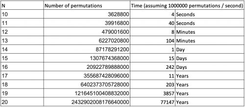

## 1. Introduction
In this article, we'll look at how to create [permutations of an array](https://www.baeldung.com/cs/array-generate-all-permutations).

First, we'll define what a permutation is. Second, we'll look at some constraints. And third, we'll look at three ways to calculate them: recursively, iteratively, and randomly.

We'll focus on the implementation in Java and therefore won't go into a lot of mathematical detail.

## 2. What Is a Permutation?
A permutation of a set is a rearrangement of its elements. A set which consists of n elements has n! permutations. Here n! is the factorial, which is the product of all positive integers smaller or equal to n.

### 2.1. Example
The array of integers `[3,4,7]` has three elements and six permutations:
`n! = 3! = 1 x 2 x 3 = 6`

**Permutations**: `[3,4,7]; [3,7,4]; [4,7,3]; [4,3,7]; [7,3,4]; [7,4,3]`
### 2.2. Constraints
The number of permutation increases fast with n. While it takes only a few seconds to generate all permutations of ten elements, it will take two weeks to generate all permutations of 15 elements:


## 3. Algorithms
### 3.1. Recursive Algorithm
The first algorithm we look at is Heap's algorithm. It's a recursive algorithm which produces all permutations by swapping one element per iteration.

The input array will be modified. If we don't want that, we need to create a copy of the array before calling the method:
```js
function printAllRecursive(n, elements, delimiter) {
    if (n == 1) {
        printArray(elements, delimiter);
    } else {
        for (var i = 0; i < n - 1; i++) {
            printAllRecursive(n - 1, elements, delimiter);
            if (n % 2 == 0) {
                swap(elements, i, n - 1);
            } else {
                swap(elements, 0, n - 1);
            }
        }
        printAllRecursive(n - 1, elements, delimiter);
    }
}
```
The method uses two helper methods:

```js
function swap(input, i, j) {
    var tmp = input[i];
    input[i] = input[j];
    input[j] = tmp;
}

function printArray(input, delimiter) {
    console.log(input);
}
```